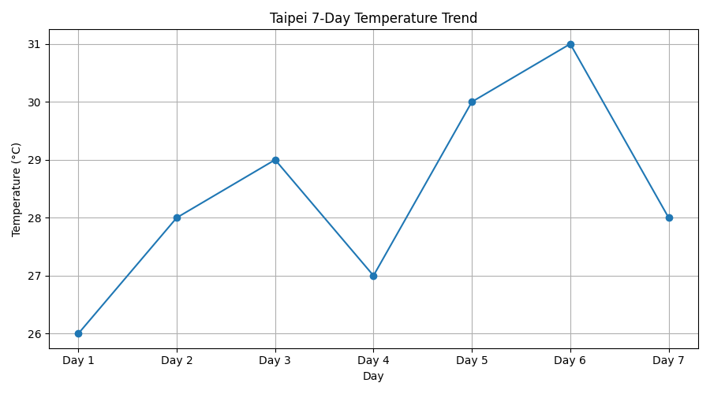
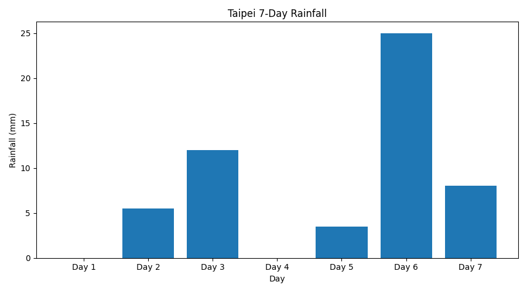
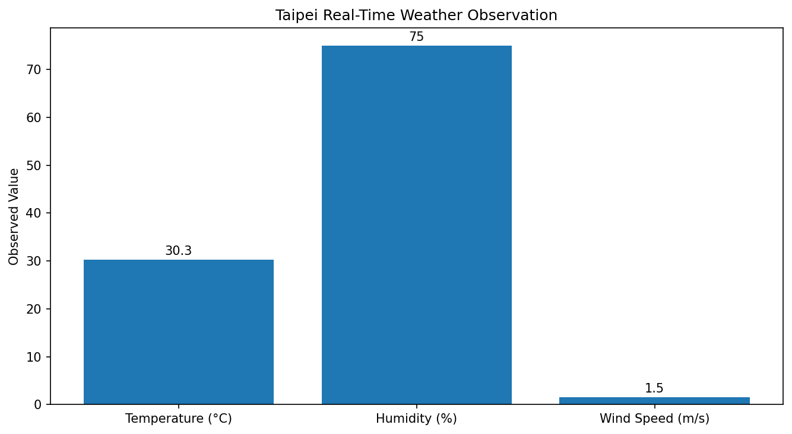
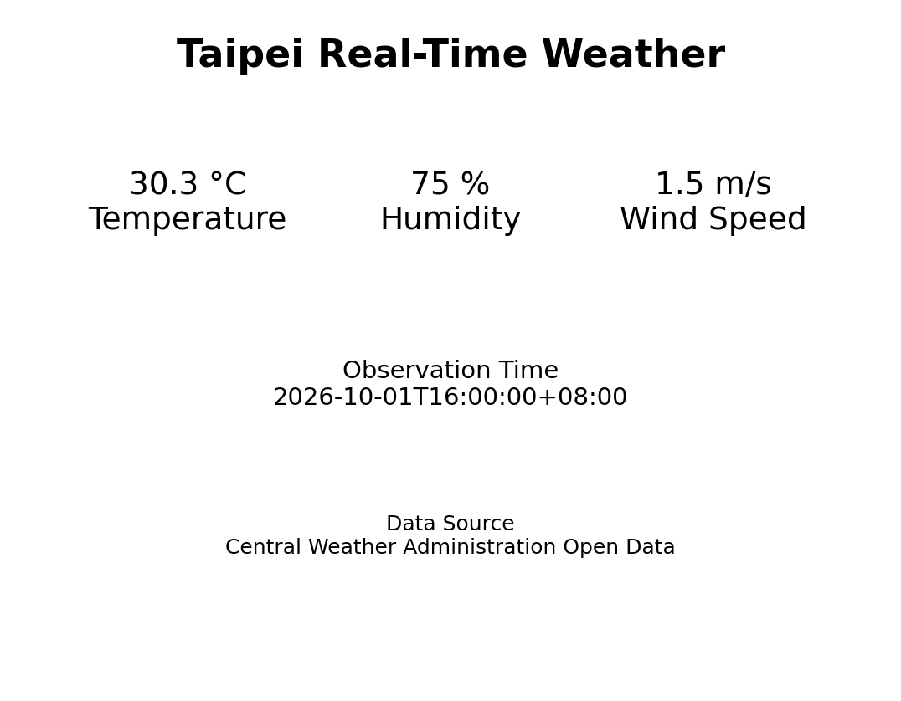
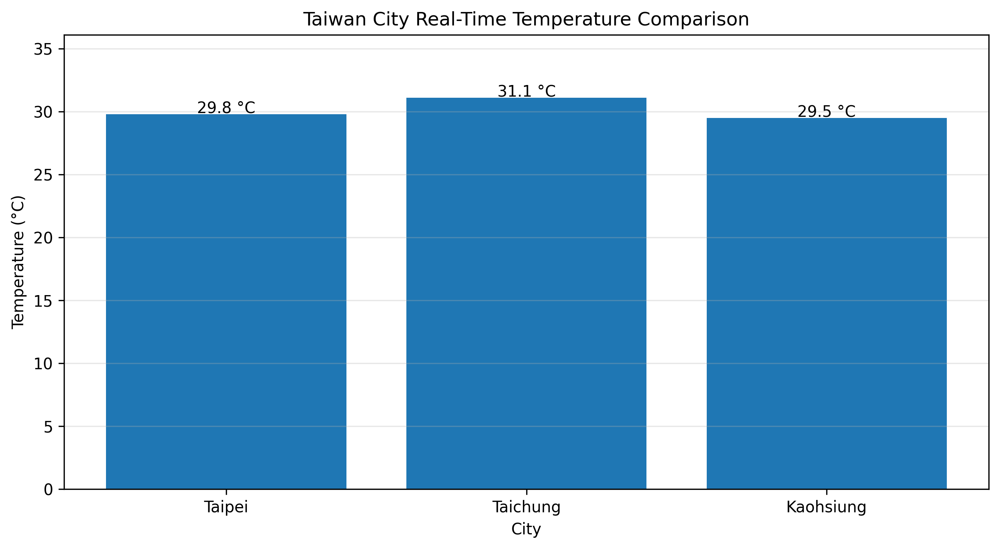
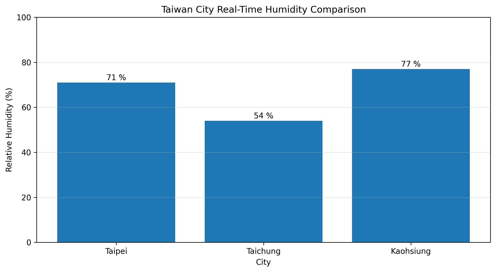
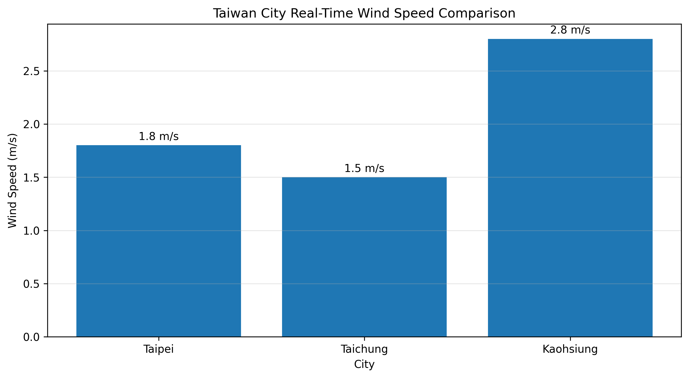
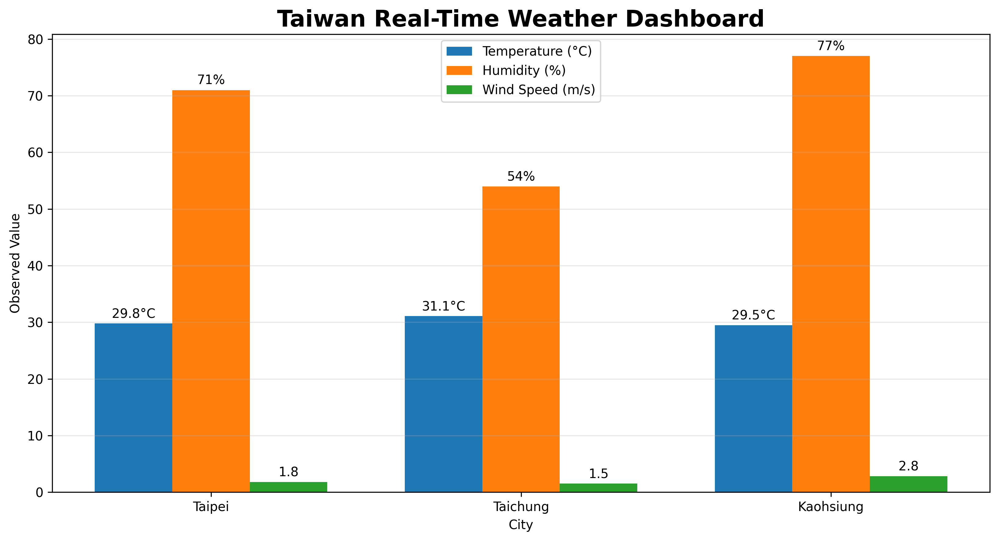

# 🌦️ 台灣天氣資料分析系統

## 📌 專案介紹

本專案使用 Python 進行台灣天氣資料分析，透過溫度與降雨量資料，計算平均溫度、最高溫度、最低溫度、累積雨量及最大單日雨量，並使用 Matplotlib 將資料轉換為視覺化圖表。

本專案將持續加入更多氣象資料與分析功能。

---

## 🔍 分析功能

- 🌡️ 7 天溫度資料分析
- 📊 平均溫度計算
- 🔺 最高溫度分析
- 🔻 最低溫度分析
- 🌧️ 7 天降雨量分析
- 💧 累積雨量計算
- ☔ 最大單日雨量分析
- 📈 溫度變化趨勢圖
- 📊 每日降雨量長條圖

---

## 📈 分析成果

### 7 天溫度變化趨勢

### 7 天降雨量分析

---

## 🛠️ 使用技術

- Python
- Matplotlib
- Google Colab
- GitHub

---

## 📚 開發歷程

### Version 1
建立 7 天溫度資料，完成平均溫度、最高溫度與最低溫度分析。

### Version 2
新增每日降雨量資料，完成總雨量、平均雨量與最大單日雨量分析。

### Version 3
使用 Matplotlib 建立溫度趨勢折線圖與每日降雨量長條圖。

---

## 🎯 後續規劃

- 導入真實氣象公開資料
- 分析不同月份的溫度變化
- 比較不同城市的氣象差異
- 建立互動式天氣資料分析網站

---

## 📝 學習紀錄

透過本專案學習 Python 基礎資料處理、串列運算、平均值與最大最小值計算，以及使用 Matplotlib 進行資料視覺化。

未來將持續增加新的資料來源與分析功能。
---

## 🌐 V4｜中央氣象署 Open Data API 即時氣象分析

本階段進一步串接交通部中央氣象署 Open Data API，
透過 Python 自動取得臺北測站即時氣象觀測資料，
並將取得的 JSON 資料進行解析與視覺化。

### 📡 資料來源

交通部中央氣象署 Open Data API

### 🔍 即時分析項目

- 🌡 即時溫度（Temperature）
- 💧 相對濕度（Relative Humidity）
- 💨 風速（Wind Speed）
- 🕒 觀測時間（Observation Time）
- 📍 臺北氣象測站

### 📊 即時氣象資料視覺化

### 🌤 即時氣象資訊卡

### 💻 V4 Python 程式

程式檔案：

`weather_api_analysis.py`

本程式利用 Python Requests 套件向中央氣象署 Open Data API 發送資料請求，
取得 JSON 格式氣象資料後，擷取臺北測站之溫度、相對濕度、風速與觀測時間，
再利用 Matplotlib 將即時資料轉換為視覺化成果。

### 🔐 API Key 安全設計

為避免中央氣象署 API 授權碼公開於 GitHub，
本專案公開版本不儲存個人 API Key，
實際執行時需由使用者自行設定授權碼。

---

## 🚀 專案版本歷程

| 版本 | 功能 |
|---|---|
| V1 | Python 基礎溫度資料分析 |
| V2 | 新增每日降雨量分析 |
| V3 | 新增溫度趨勢圖與降雨量長條圖 |
| V4 | 串接中央氣象署 Open Data API，取得臺北測站即時氣象資料 |

---

## 🎯 專案學習成果

透過本專案學習 Python 資料處理、基礎統計分析、Matplotlib 資料視覺化、
Open Data API 串接及 JSON 資料解析，並實際將程式碼與分析成果透過 GitHub
進行版本管理與公開展示。

---

# 🌏 V5｜臺灣三城市即時氣象比較系統

## 📌 開發動機

在完成臺北單一測站的即時氣象資料分析後，
我想進一步了解臺灣不同城市之間的天氣是否存在差異，
因此選擇臺北、臺中及高雄三個城市進行即時氣象資料比較。

本專案利用中央氣象署 Open Data API 自動取得即時觀測資料，
再使用 Python 進行資料整理與視覺化。

---

## 🔍 分析項目

- 臺北、臺中、高雄即時氣溫
- 三城市相對濕度比較
- 三城市風速比較
- 即時氣象 Dashboard

---

## 🌡️ 三城市溫度比較

---

## 💧 三城市相對濕度比較

---

## 💨 三城市風速比較

---

## 📊 Taiwan Real-Time Weather Dashboard

---

## 💻 V5 程式

`taiwan_weather_analysis_v5.py`

---

## 🧩 開發過程遇到的問題

在專案開發過程中，我曾遇到 API 授權錯誤、SSL 憑證問題、
變數尚未建立、資料型態不同及 Python 程式縮排錯誤等問題。

透過逐步檢查錯誤訊息、修改程式及重新測試，
最後成功取得中央氣象署即時資料並完成視覺化分析。

---

## 📚 我的學習成果

透過這個專案，我學習到：

- Python 基礎程式設計
- API 資料串接
- JSON 資料解析
- Open Data 公開資料應用
- Matplotlib 資料視覺化
- GitHub 程式版本管理
- API Key 基本資訊安全觀念
- 程式除錯與問題解決

這個專案也讓我了解，
程式設計不只是撰寫程式碼，
還需要將資料取得、整理、分析及呈現整合成完整的資訊系統。
